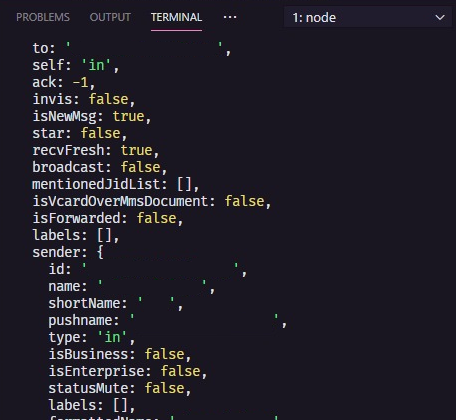

# Chatbot-for-whatsapp             

                                     

> Chatbot para trocar mensagens atráves do seu whatsapp.

O chatbot pode responder os contatos do seu whatsapp baseado nas mensagens que ele lê. O projeto atual foi feito simulando uma pizzaria e o bot faz o atendimento. 

Você vai precisar de dois celulares conectados com whatsapp. Um envia as mensagens e o outro é usado pelo bot para receber e responder. ( também pode pedir a um familiar ou amigo para ajudar ) 

O ideal é usar um celular com um número novo, para não correr riscos de algum contato enviar mensagem e o bot responder por acidênte. 


## Instalação

Baixe ou clone o repositório para ter acesso ao código e desenvolver.

no seu editor de código preferencial, abra o terminal e digite:

### NPM

```sh
npm install
```

### yarn

```sh
yarn install
```

essa ação irá instalar os seguintes módulos:

venom-bot": "^1.1.4"

## Configuração para Desenvolvimento

Depois de instalado os módulos, execute o script criado para inicializar o projeto: 

### NPM

```sh
npm dev
```
### yarn

```sh
yarn dev
```

Isso irá executar a aplicação e gerar, no seu terminal, um QR code para autenticação do whatsapp web. Com seu aparelho em mãos, leia o código.

 Após isso, sua instância será salva e toda vez que iniciar a aplicação não precisará ler o Qr code novamente.

Depois de autenticado e tudo funcionando, você terá acesso a muitos dados sobre o usuário e a mensagem recebida pelo bot. Um exemplo:

 

obs.: Deixei um console log comentado no index, caso queira vizualizar um exemplo parecido no seu terminal.

com esses dados recebidos, existem infinitas possibilidades de coisas que podemos fazer.

qualquer duvida ou sugestão:


Matheus de Oliveira Mendonça – [@MathSilms](https://www.linkedin.com/in/mathsilms/) – Mateheusoliver@gmail.com